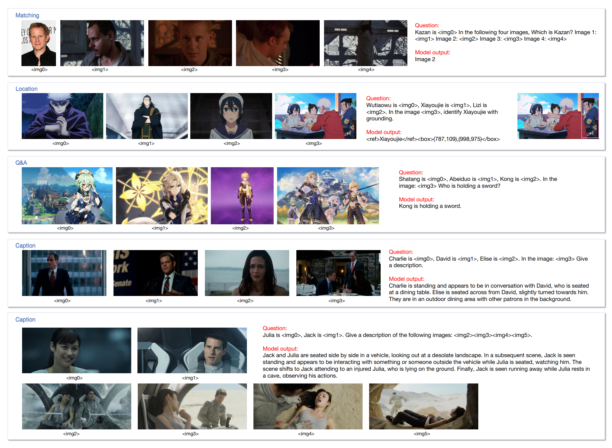

# IDA-VLM

This is the code base for [IDA-VLM: Towards Movie Understanding via ID-Aware Large Vision-Language Model](https://arxiv.org/pdf/2407.07577).

We propose visual instruction tuning with ID reference, which unleashes the potential of LVLM in identity memory and recognition across diverse scenes, and develop an ID-aware LVLM, IDA-VLM. This paper paves the way for future artificial intelligence systems to possess multi-identity visual inputs, thereby facilitating the comprehension of complex visual narratives like movies.

Samples:

  
Animation image urls

https://img1.doubanio.com/view/photo/l/public/p2625512480.webp, https://img1.doubanio.com/view/photo/m/public/p2901199610.webp, https://img2.doubanio.com/view/photo/m/public/p2896107391.webp, https://img2.doubanio.com/view/photo/l/public/p2895851711.webp, https://olimg.3dmgame.com/uploads/images/xiaz/2021/0924/1632447816995.jpg, https://i0.hdslb.com/bfs/archive/0384c2f5139013b1ceae84395bbd58fae25898ef.jpg, https://act-webstatic.mihoyo.com/event-static/2023/08/15/9797cacf6d60a54f91fb6f68546b43e1_6723404097102093983.jpg?x-oss-process=image/quality,Q_80/resize,m_lfit,s_700

Todo list:

- [x] Release code.
- [ ] Release benchmark images, tuning data, model weights. (under the approval process)
- [ ] Easy start.
- [ ] Make Demo.

We have three main contributions: [MM-ID](./mm-id/), [tuning data construction](./ID_reference_data/) and [model training](./model).

In [MM-ID](./mm-id/), we introduce the task format and evaluation methods. [ID_reference_data](./ID_reference_data/) contains the processing code for producing instruction tuning data. [Model](./model/) includes training and inference code, which is based on Qwen-VL-Chat.

For a quickstart, you need download images of MM-ID and model weights, to complete instruction task with ID inference. 

# License

The majority of this project is licensed under [Qwen-VL License](https://github.com/QwenLM/Qwen-VL/blob/master/LICENSE).

# Acknowledge
* [Qwen-VL](https://github.com/QwenLM/Qwen-VL): The codebase we build upon.
* [MovieNet](https://movienet.github.io/): The main dataset we use for tuning data construction.
