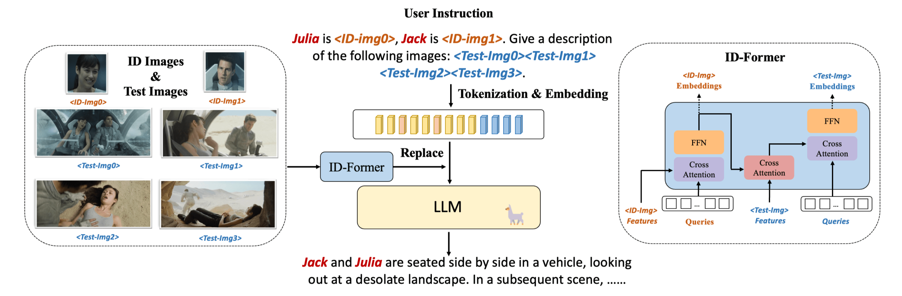

# Model

## Base

IDA-VLM is fine-tuned from [Qwen-VL-Chat](https://github.com/QwenLM/Qwen-VL). We adopt a dual-stage fine-tuning method to train the model on identity memory and recognition across diverse scenes.

The initial phase leverages annotations in VCR, Flickr30k and RefCOCO, while the second stage tuning data is based on MovieNet.

The running environment is the same as Qwen-VL's. Our finetuning code:

> bash finetune/finetune_ds.sh

To inference on MM-ID:

> python inference_test.py

The fine-tuned model weight can be downloaded from [here]().

More model details can be found at [Qwen-VL-Chat](https://github.com/QwenLM/Qwen-VL).

You can also use our constructed tuning data to unleash the potential of other LVLMs in ID recognition. Note that the required base model should be able to handle multiple images.

## ID-Former

We also introduce a specialized component, termed ID-Former, to enhance the model’s capability of recognizing character identities.

  
To utilize ID-Former

ID-Former's architecture can be seen in Line 153 of visual.py in model folder. After you download the model weight, the same files can be found in weight folder.

Note that if you want to train with ID-Former, you need open 'use_llava', which will use two dataloader, one is for ID reference tuning data and the other one is for llava, sharegpt4v training data.

To load two dataloaders, you need replace trainer.py in your transformers lib.

In the newest version, we use vcr(30k), f30k(30k), RefCOCO(20k), llava(10k) in the first stage tuning, and MovieNet(60k), llava(6k), sharegpt4v(4k) in the second stage. Under this condition, IDA-VLM has comprehensive highest performance. 

| Model            | Matching | Location |  QA  | Caption |
| ---------------- | -------- | -------- | ---- | ------- |
| IDA-VLM (500s)   |  0.806   |  0.854   | 5.74 |   5.32  |
| IDA-VLM (2500s)  |  0.791   |  0.821   | 5.54 |   5.44  |

The weights of the newest version is [here]().
